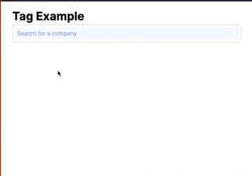

# Vue Tags

## Tag input demo

The example uses company data from the SEC to create a searchable list of stocks.  Fuse.js is used to provide a fuzzy search.

See the `App.vue` file for an example use.

